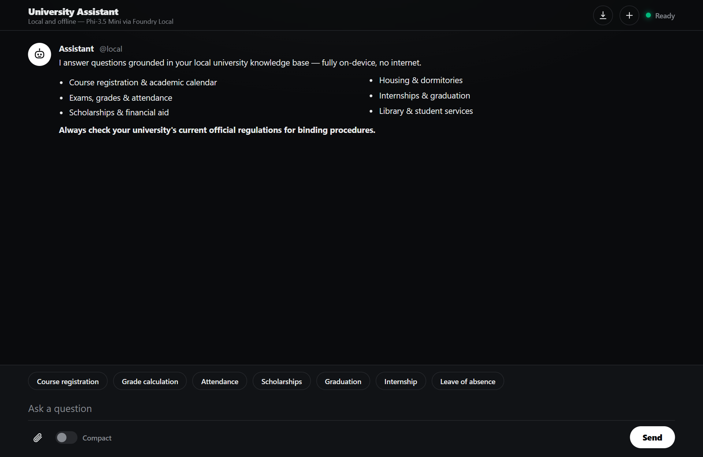
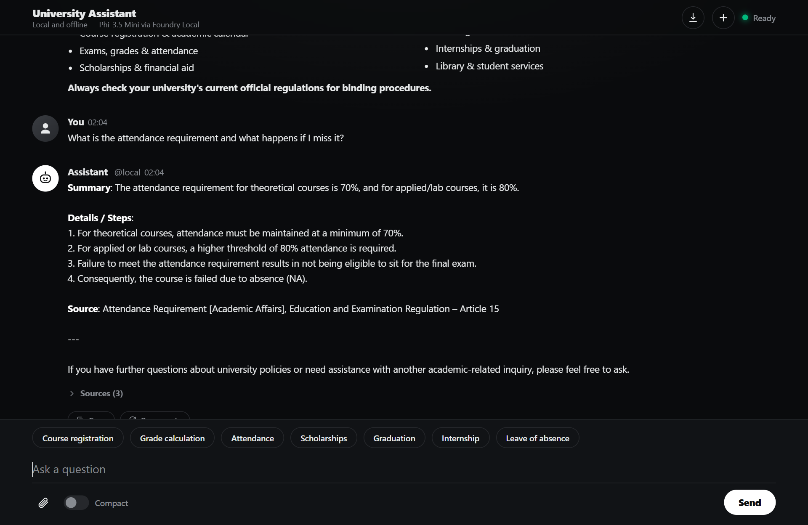
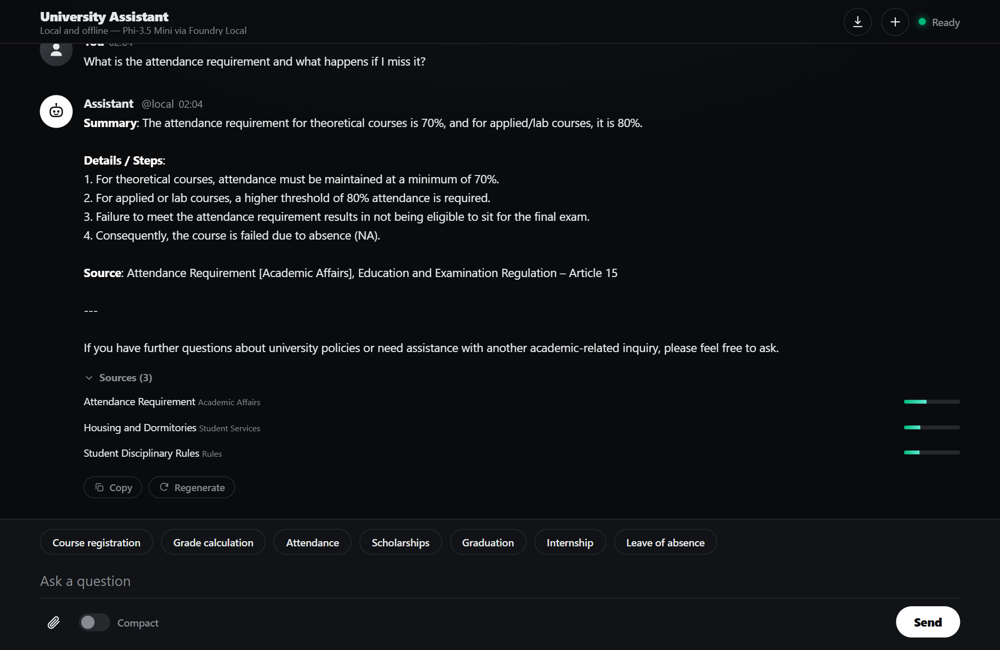
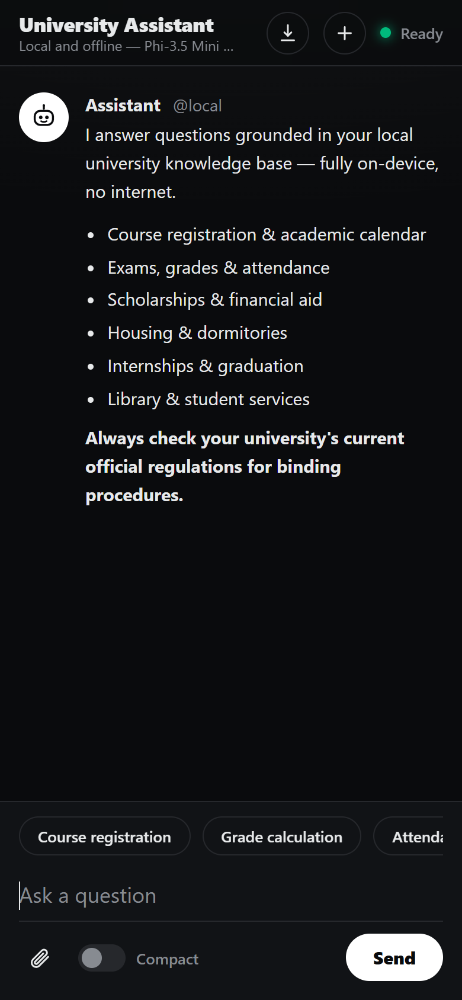
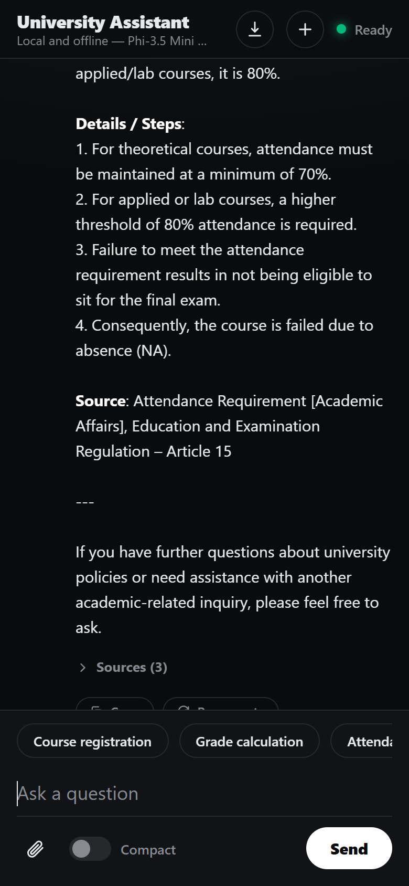
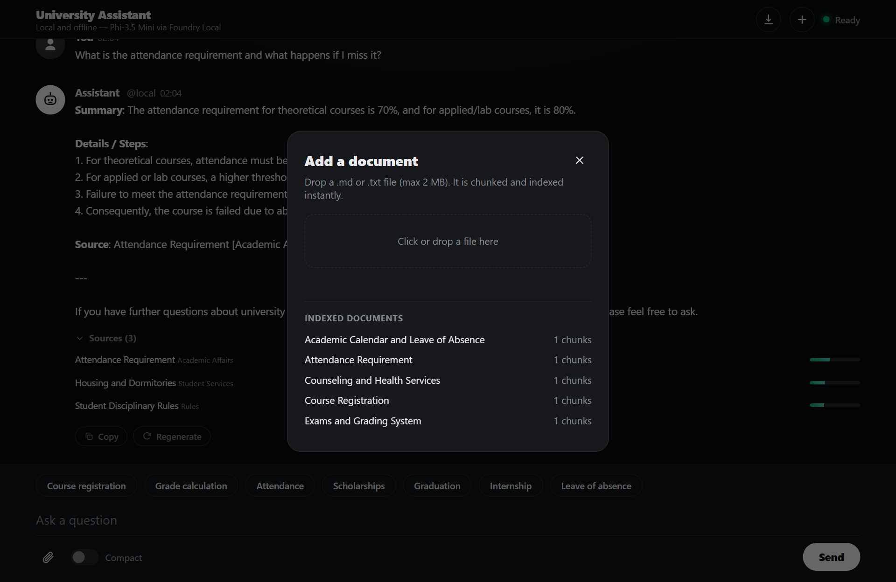

# Building Your First Local RAG Application with Foundry Local

*A developer's guide to building an offline AI student assistant using Retrieval-Augmented Generation, the Foundry Local SDK, and JavaScript.*

---

Imagine it is 2 a.m. the night before the add-drop deadline. A student needs to know the exact attendance rule, how the GPA is calculated, and whether their scholarship survives a failed course — and the answers are buried across a dozen PDFs on the university website.

This is the problem this project solves: a **fully offline RAG-powered student assistant** that runs entirely on your machine. No cloud. No API keys. No outbound network calls. Just a local language model, a local vector store, and your own documents, all accessible from a browser on any device.

In this post you will learn how it works, how to build your own, and the key architectural decisions behind it.



## What is RAG and Why Does It Matter?

**Retrieval-Augmented Generation (RAG)** is a pattern that makes AI models genuinely useful for domain-specific tasks. Rather than hoping the model "knows" the answer from its training data, you:

1. **Retrieve** relevant chunks from your own documents
2. **Augment** the model's prompt with those chunks as context
3. **Generate** a response grounded in your actual data

The result is fewer hallucinations, traceable answers, and an AI that works with *your* content rather than relying on general knowledge.

If you are building internal tools, support bots, handbooks, or knowledge bases, RAG is the pattern you want.

### RAG vs CAG: Two Approaches to Grounding

This project uses **RAG**, but there is a complementary pattern called **Context-Augmented Generation (CAG)**. The [local-cag sample](https://github.com/leestott/local-cag) demonstrates CAG using the same Foundry Local stack.

| | RAG (this project) | CAG |
|---|---|---|
| **How context is provided** | Retrieved dynamically per query from a vector store | Entire document set loaded into the context window upfront |
| **Best for** | Large or growing document collections | Small, stable document sets that fit in the model's context |
| **Retrieval step** | TF-IDF or embedding search selects the top-K chunks | No retrieval needed; all content is always available |
| **Scalability** | Scales to thousands of documents | Limited by the model's context window size |
| **When to choose** | Documents change often, are large, or you need precise sourcing | A small, curated set where you want maximum simplicity |

If you are building a knowledge base for a handful of documents, start with CAG. If you need to scale or want fine-grained source attribution, choose RAG.

## The Stack

This project is intentionally simple. No frameworks, no build steps, no Docker:

| Layer | Technology | Why |
|-------|-----------|-----|
| **AI Model** | [Foundry Local](https://foundrylocal.ai) + Phi-3.5 Mini | Runs locally via the SDK, no GPU needed |
| **Backend** | Node.js + Express | Lightweight, fast, widely understood |
| **Vector Store** | SQLite (via `better-sqlite3`) | Zero infrastructure, single file on disk |
| **Retrieval** | TF-IDF + cosine similarity | No embedding model required, fully offline |
| **Frontend** | Single HTML file with inline CSS | No build step, responsive, streaming UI |

The total runtime dependency footprint is just three npm packages: `express`, `foundry-local-sdk`, and `better-sqlite3`.

## Getting Started

### Prerequisites

1. **Node.js 20+** from [nodejs.org](https://nodejs.org/)
2. **Foundry Local**, Microsoft's on-device AI runtime:
   ```
   winget install Microsoft.FoundryLocal
   ```

The SDK downloads the Phi-3.5 Mini model (approximately 2 GB) the first time you run the application.

### Setup

```bash
git clone https://github.com/Armitorenk/local-rag-university.git
cd local-rag-university
npm install
npm run ingest   # Index the 12 university documents
npm start        # Start the server (loads the model via the SDK)
```

Open `http://127.0.0.1:3000` and start chatting.

> On first start the SDK fetches the model catalog from the cloud once. If that call is rate-limited (HTTP 429), the chat engine retries with backoff automatically — the model itself still runs locally.

## Architecture Overview

```
Browser (single HTML file)
   │  POST /api/chat/stream
   ▼
Express server
   ├─►  VectorStore  ──  SQLite (rag.db)   TF-IDF + cosine → top-3 chunks
   └─►  ChatEngine   ──  prompt = system + retrieved context + question
            ▼
        Foundry Local → Phi-3.5 Mini → streamed tokens (SSE) → browser
```

All five layers run on a single machine:

- **Client**: a single HTML file served by Express, with quick-action chips and a streaming chat interface
- **Server**: Express handles chat (streaming + non-streaming), document upload, and health checks
- **RAG pipeline**: the chat engine orchestrates retrieval and generation; the chunker handles TF-IDF vectorisation; the prompts module provides grounded system instructions
- **Data**: SQLite stores document chunks and their TF-IDF vectors; documents live as `.md` files in `docs/`
- **AI**: Foundry Local runs Phi-3.5 Mini on GPU/NPU/CPU, managed entirely through the JavaScript SDK

## How the RAG Pipeline Works

Let us trace what happens when a student asks: **"What is the attendance requirement?"**

```
question → TF-IDF vector → inverted-index candidates → cosine top-3
        → prompt(system + chunks + question) → Phi-3.5 Mini → stream
```

### Step 1: Document Ingestion

Before any queries happen, you run `npm run ingest`. This script:

1. Reads every `.md` file from `docs/`
2. Parses optional YAML front-matter (title, category, id)
3. Splits each document into overlapping chunks (~200 tokens, 25-token overlap)
4. Computes a TF-IDF vector for each chunk
5. Stores everything in `data/rag.db` (SQLite)

### Step 2: Query to Retrieval

When the user sends "What is the attendance requirement?", the server:

1. Converts the question into a TF-IDF vector
2. Uses an inverted index to find candidate chunks that share terms with the query
3. Scores candidates with cosine similarity and returns the top 3

A **relevance guard** drops weak matches: if even the best chunk barely matches (e.g. for a greeting or an off-topic question), the context becomes "no relevant documents," which stops the model from inventing an answer.

### Step 3: Prompt Construction

The retrieved chunks are injected into the prompt alongside the system instructions:

```
System: You are a local, offline university student assistant. Use only the retrieved context...
Context:
  [Chunk 1: Attendance Requirement — General Rule...]
  [Chunk 2: Attendance Requirement — Excuses...]
User: What is the attendance requirement?
```

### Step 4: Generation and Streaming

The prompt is sent to the local model via the Foundry Local SDK. The response streams back token by token through Server-Sent Events (SSE):



Every response includes expandable source references with relevance scores, so you can verify exactly which documents the AI used:



## Foundry Local: Your On-Device AI Runtime

[Foundry Local](https://foundrylocal.ai) is what makes the "offline" part possible. It is a local runtime from Microsoft that:

- Runs small language models (SLMs) on GPU, NPU, or CPU
- Manages model discovery, downloading, and lifecycle through the SDK
- Provides a native chat client for completions and streaming
- Works entirely offline once the model is cached

The integration code is clean and direct:

```js
import { FoundryLocalManager } from "foundry-local-sdk";

const manager = FoundryLocalManager.create({ appName: "university-assistant" });
const model = await manager.catalog.getModel("phi-3.5-mini");
await model.download();
await model.load();

const chatClient = model.createChatClient();
const response = await chatClient.completeChat([
  { role: "system", content: "You are a helpful assistant." },
  { role: "user", content: "What is the attendance requirement?" }
]);

console.log(response.choices[0].message.content);
```

The SDK handles service lifecycle, model discovery, hardware-optimised inference, and streaming.

## Why TF-IDF Instead of Embeddings?

Most RAG tutorials use embedding models for retrieval. This project uses TF-IDF because:

1. **Fully offline**: no embedding model to download or run
2. **Zero latency**: vectorisation is instantaneous — it is just maths on word frequencies
3. **Good enough**: for a curated collection of 12 domain-specific documents, TF-IDF with cosine similarity retrieves the right chunks reliably
4. **Transparent**: you can inspect the vocabulary and weights, unlike neural embeddings

For larger collections (thousands of documents) or when semantic similarity matters more than keyword overlap, swap in an embedding model.

### Performance Optimisations

- **Inverted index**: maps terms to chunk IDs, so only chunks sharing a query term are scored
- **In-memory row cache**: parsed TF-IDF maps are kept in memory after first access
- **Prepared statements**: all SQL queries are prepared once and reused

These keep retrieval time sub-millisecond for typical loads.

## A Responsive, Streaming UI

The interface is a single HTML file with inline CSS — no build step:

- **Dark, minimal theme** with comfortable typography
- **Full-width timeline** with streaming token-by-token answers
- **Quick-action chips** for common questions, no typing needed
- **Per-answer actions**: Copy, Regenerate, and Stop generation
- **Conversation features**: timestamps, Markdown export, and localStorage persistence across refreshes
- **Responsive** from narrow phones to wide desktops

| Desktop | Mobile |
|---------|--------|
|  |  |



## Runtime Document Upload

Users can upload new documents without restarting the server:



The upload endpoint (`POST /api/upload`) receives the markdown content, chunks it, computes TF-IDF vectors, and inserts the chunks into SQLite in memory. The new document is immediately available for retrieval.

## Grounded Prompting

For a knowledge-base assistant, the system prompt is engineered to:

1. **Use only the retrieved context** — never invent rules, numbers, dates, or article references
2. **Fail gracefully** — if the information is not in the knowledge base, say so explicitly
3. **Cite sources** — every answer references the specific document and section
4. **Handle greetings / off-topic input** — reply briefly and politely without fabricating

```
Format: Summary > Details / Steps > Source
```

This pattern transfers to any domain where accuracy matters: HR policies, IT support, product manuals, legal handbooks.

## Adapting This for Your Own Domain

This project is a **scenario sample** designed to be forked and adapted:

### 1. Replace the Documents

Swap the docs in `docs/` for your own `.md` files. The ingestion pipeline handles any markdown with optional YAML front-matter:

```markdown
---
title: Troubleshooting Login Issues
category: IT Support
id: KB-001
---

# Troubleshooting Login Issues
...your content here...
```

### 2. Edit the System Prompt

Open `src/prompts.js` and rewrite the prompt for your domain (keep the "use only retrieved context, never fabricate, handle off-topic" rules).

### 3. Tune the Retrieval

In `src/config.js`:
- `chunkSize: 200` — smaller chunks give more precise retrieval
- `chunkOverlap: 25` — prevents information falling between chunks
- `topK: 3` — how many chunks to retrieve per query

### 4. Swap the Model

Change `config.model` in `src/config.js` to any model in the Foundry Local catalog. Larger models give better quality (e.g. stronger multilingual answers); smaller ones are faster on constrained devices.

## Running Tests

```bash
npm test
```

Tests use the built-in Node.js test runner — no extra framework needed.

## What to Build Next

- **Embedding-based retrieval** for better semantic matching
- **Multi-modal support** (for example, photographing a form)
- **PWA packaging** so it installs as a standalone app
- **Hybrid retrieval** combining TF-IDF with embeddings
- **Try the CAG approach** with the [local-cag sample](https://github.com/leestott/local-cag)

## Summary

Building a local RAG application does not require a PhD in machine learning or a cloud budget. With Foundry Local, Node.js, and SQLite you can create a fully offline AI assistant that answers questions grounded in your own documents.

Key takeaways:

1. **RAG = Retrieve + Augment + Generate** — ground your AI in real documents
2. **Foundry Local** makes local AI accessible with a simple SDK, no GPU required
3. **TF-IDF + SQLite** is a viable vector store for small-to-medium collections
4. A **relevance guard** plus a grounded prompt keep a small model honest on off-topic input

Clone the repository, swap in your own documents, and start building.

---

*This project is open source under the MIT licence. It is a scenario sample for learning and experimentation, adapted from [`leestott/local-rag`](https://github.com/leestott/local-rag).*
